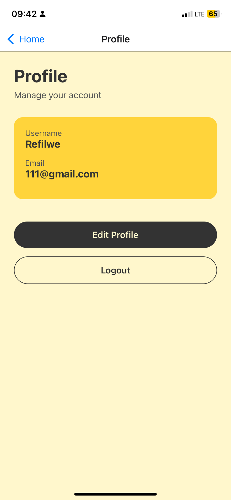
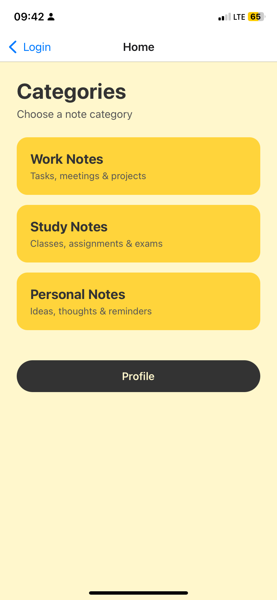

 React Notes Application
A simple and intuitive React Notes Application that allows users to create, edit, and delete notes. This app is designed to demonstrate core React concepts such as state management, component-based architecture, and user interaction handling.

 Features

 Add new notes

 Edit existing notes

 Delete notes

 View all saved notes

 Notes persist during app usage (state-based)

 Clean and user-friendly interface

 Built With

React – Frontend library

JavaScript (ES6+)

HTML5 & CSS3

 Project Structure
react-notes-app/
├── src/
│   ├── components/
│   │   ├── Note.jsx
│   │   ├── NoteList.jsx
│   │   └── NoteForm.jsx
│   ├── App.jsx
│   ├── index.js
│   └── styles.css
├── public/
├── package.json
└── README.md

⚙️ Installation & Setup

Clone the repository
git clone https://github.com/your-username/react-notes-app.git

Navigate to the project folder
cd react-notes-app

Install dependencies
npm install

Start the development server
npm start

 How It Works

Notes are stored in React state.

Each note can be edited or deleted individually.

Components are reusable and follow best practices.

State updates automatically re-render the UI.

 Screenshots

Reference them like this:

